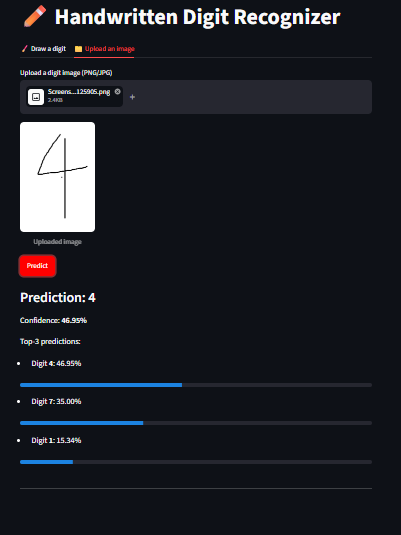
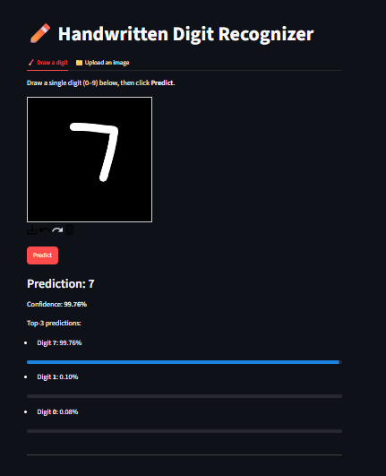
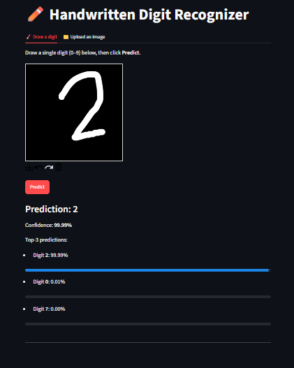

# ✏️ Digit Recognizer — CNN (PyTorch) + Streamlit

A handwritten digit classifier (0–9) trained on the Kaggle **Digit
Recognizer** (MNIST-format) dataset, built as a two-environment project:
model development/training in **Google Colab**, and an inference-only
**Streamlit** app.





## 🎯 Project Objective

Classify a 28×28 grayscale handwritten digit image into one of 10 classes
(0–9), using a convolutional neural network, and expose the trained model
through an interactive web app where a user can draw or upload a digit and
get a real-time prediction.

## 🧠 Model

`SimpleCNN` — a compact 2-block CNN:

```
Conv(1→32, 3x3) → BatchNorm → ReLU → MaxPool(2x2)
Conv(32→64, 3x3) → BatchNorm → ReLU → MaxPool(2x2)
Flatten → Linear(3136→128) → ReLU → Dropout(0.25) → Linear(128→10)
```

Trained with data augmentation (random rotation ±10°, random shift ±2px),
Adam optimizer, `ReduceLROnPlateau` LR scheduling, early stopping, and
best-checkpoint selection by validation accuracy.

| Model | Validation Accuracy |
|---|---|
| Random Forest baseline | 96.12% |
| CNN, no augmentation | 98.98% |
| **CNN, augmented (`best_model.pth`)** | **99.40%** |

**Best model — full metrics (weighted):** precision 0.9941 · recall 0.9940 · F1 0.9941

Full evaluation (confusion matrix, per-class precision/recall/F1) was
generated in `notebooks/03_Evaluation_and_Export.ipynb` and saved to
`outputs/evaluation_metrics.json`. The confusion matrix is strongly
diagonal, with the only mild soft spots being digit **8** (lowest
precision, 0.9828) and digit **5** (lowest recall, 0.9853) — consistent
with the classic MNIST 3/5/8 confusion cluster.

## 🏗️ Architecture: Two Environments

This project intentionally separates **training** from **application**:

| | Google Colab | VS Code |
|---|---|---|
| Responsibilities | Data loading, EDA, preprocessing, augmentation, training, tuning, evaluation, exporting artifacts | Streamlit app, inference pipeline, modules, docs, packaging |
| Never does | — | Retraining the model |
| Key output | `models/best_model.pth` + `outputs/*` | Runnable app that loads that `.pth` file |

## 📁 Project Structure

```
digit-recognizer-cnn/
│
├── notebooks/                          # Google Colab
│   ├── 01_EDA_and_Baseline.ipynb       # data load, EDA, RF baseline
│   ├── 02_CNN_Training.ipynb           # SimpleCNN, augmentation, checkpointing, LR scheduler, early stopping
│   └── 03_Evaluation_and_Export.ipynb  # confusion matrix, report, curves, submission.csv
│
├── models/
│   ├── best_model.pth                  # best val-accuracy checkpoint (used by the app)
│   └── final_model.pth                 # last-epoch checkpoint (kept for comparison)
│
├── outputs/
│   ├── baseline_metrics.json
│   ├── evaluation_metrics.json
│   ├── training_history.pkl
│   ├── confusion_matrix.png
│   ├── accuracy_plot.png
│   ├── loss_plot.png
│   └── submission.csv
│
├── app/                                 # VS Code — inference only
│   ├── streamlit_app.py                # UI: draw/upload a digit → prediction
│   ├── predictor.py                     # high-level predict() wrapper
│   ├── model_loader.py                  # loads SimpleCNN + best_model.pth
│   ├── model_def.py                     # SimpleCNN architecture (shared source of truth)
│   ├── preprocessing.py                 # image → normalized tensor (mirrors training preprocessing)
│   ├── config.py                        # paths & constants
│   └── utils.py                         # softmax / top-k helpers
│
├── assets/                              # screenshots for this README
├── requirements.txt
├── README.md
└── .gitignore
```

## 🚀 Getting Started

### Part 1 — Train the model (Google Colab)

1. Upload `notebooks/01_EDA_and_Baseline.ipynb`, `02_CNN_Training.ipynb`,
   and `03_Evaluation_and_Export.ipynb` to Google Colab (or open directly
   from a GitHub clone via Colab's "Open from GitHub").
2. Mount your Google Drive (uncomment the `drive.mount(...)` cell in each
   notebook) and set `PROJECT_ROOT` to your Drive folder.
3. Place `train.csv` / `test.csv` in `PROJECT_ROOT/data/`, or use the
   Kaggle API steps documented inside `01_EDA_and_Baseline.ipynb`.
4. Run the notebooks **in order**: 01 → 02 → 03.
5. Notebook 03 will save everything the app needs to
   `PROJECT_ROOT/models/best_model.pth`.

### Part 2 — Run the app (VS Code)

1. Download `best_model.pth` from your Drive into the local
   `digit-recognizer-cnn/models/` folder.
2. Install dependencies:
   ```bash
   pip install -r requirements.txt
   ```
3. Launch the app from the project root:
   ```bash
   streamlit run app/streamlit_app.py
   ```
4. Draw a digit or upload an image and click **Predict**.

## 📊 Evaluation

Run `notebooks/03_Evaluation_and_Export.ipynb` to generate:
- Confusion matrix (`outputs/confusion_matrix.png`)
- Classification report (precision/recall/F1 per digit)
- Accuracy & loss curves (`outputs/accuracy_plot.png`, `outputs/loss_plot.png`)
- `outputs/evaluation_metrics.json` — baseline vs. CNN comparison

## 🌐 Deployment

The Streamlit app in `app/` is deployment-ready as-is (loads a fixed
`.pth` checkpoint, no training at runtime). A live demo link will be added
here once deployed.

## 🛠️ Tech Stack

`PyTorch` · `scikit-learn` · `pandas` · `NumPy` · `matplotlib` · `Streamlit` · `Google Colab`

## 📄 License / Dataset Credit

Dataset: [Kaggle Digit Recognizer](https://www.kaggle.com/c/digit-recognizer) (MNIST-derived).

---


**GitHub description (short):**
> CNN-based handwritten digit recognizer (PyTorch, 99.4% val accuracy)
> trained in Google Colab, served through a Streamlit app — with
> checkpointing, LR scheduling, early stopping, and full evaluation
> metrics.